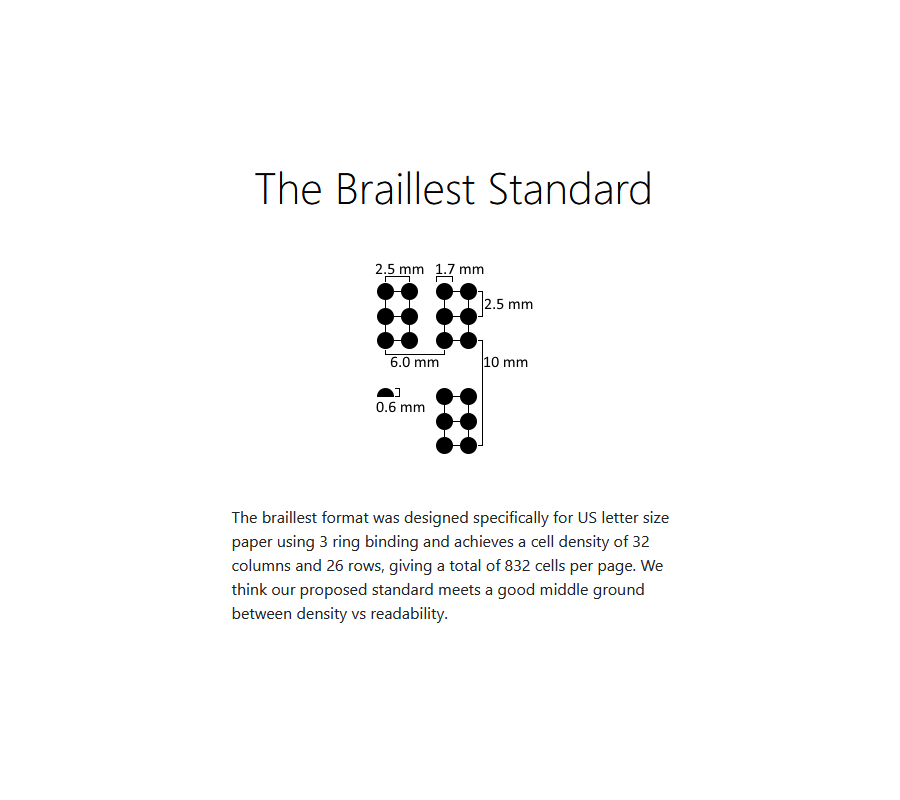

# Braillest Tooling

# Welcome!

Welcome to the primary tooling repo of the Braillest project. This repo contains all the scripts needed to:
- Source sample books from the gutenberg press website and convert them into their standalone texts.
- Translate texts into braille while optionally performing back translations to compare against.
- Perform formatting and pagination operations to comply with constraints of printing format.
- Generate the produced braille pages into mold STLs for slicing and printing.

# Getting Started

1. Download and install [Docker](https://www.docker.com/).

2. Clone this repo. `git clone git@github.com:Braillest/tooling.git`

3. Navigate to the root of the project in the terminal and run `docker compose up -d`

4. Enter the container `docker exec -it braillest_tooling bash`

5. Run the provided scripts. Ex) `python download_books.py`

# Embossing Samples

# Standard

> US letter - 32 columns and 26 rows, 
